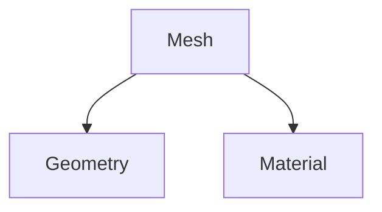
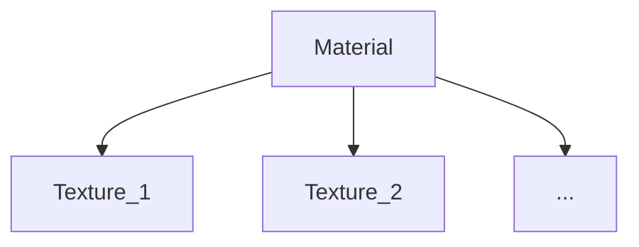

[TOC]

### 基本对象(Fundamental Object)
#### Three.js结构

#### 相机(Camera)

#### 网格(Mesh)
一个网格(Mesh)表示用一个指定的材质(texture)绘出一个指定的几何体(geometry)


#### 几何体(Geometry)
几何体包括几何体的矢量数据
(x,y,z)

#### 材质(Material)
材质表示绘制几何体的表面的属性，包括颜色，光泽度等等，材质还可以包含多个纹理，即多张图片


#### 纹理(Texture)
纹理即贴图

#### 光照(Light)
光照☞光照

### Hello Cube!
#### 基本结构


#### 创建画布
```html
<script type="module">
    import * as THREE from ""
```

#### 创建相机
##### 创建相机对象
```javascript
// Our Javascript will go here.
//场景设置
import * as THREE from '../../../library/three/build/three.module.js'

function main() {
    const canvas = document.querySelector('#c');
    //create a renderer
    const renderer = new THREE.WebGLRenderer({canvas});
    //create a frustum
    const fov = 75;//视野范围,视场角field of view
    const aspect = 2;//长宽比
    const near = 0.1;//近不渲染区域
    const far = 5;//远不渲染区域
    //create a camera
    const camera = new THREE.PerspectiveCamera(fov, aspect, near, far)
}
```

##### 设置相机位置
```javascript
camera.position.z = 2
```


[本节成果展示](../HTML/Animation.html)