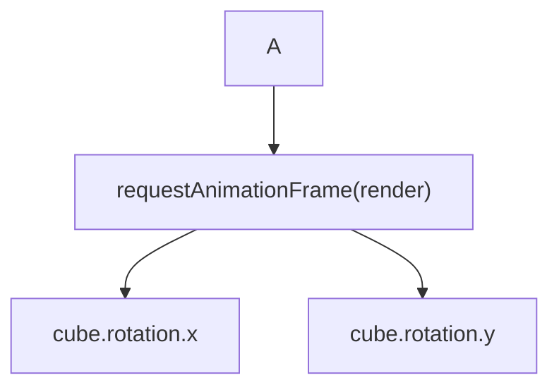

为什么这是一个循环呢？

```javascript
function render(time) {
  time *= 0.001;  // convert time to seconds
 
  cube.rotation.x = time;
  cube.rotation.y = time;
 
  renderer.render(scene, camera);
 
  requestAnimationFrame(render);
}
requestAnimationFrame(render);
```



[参考教程](https://www.youtube.com/watch?v=rNsC1VI9388)